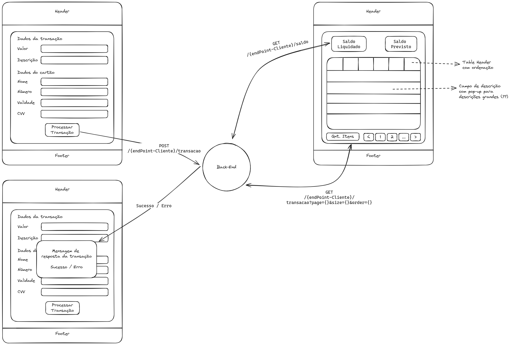

# Requisitos

- Uma tela para adição/processamento de transações.
  - Form dividido em duas seções: Dados da transação e Dados do Cartão.
  - Dados da transação:
    - Input de valor estilizado para representação monetária.
    - Input de descrição, tipo texto.
  - Dados do cartão:
    - Input de nome, tipo texto.
    - Input do número do cartão, tipo texto restrito apenas para números.
    - Input da validade. Datepicker de mes+ano.
    - Input do CVV. Tipo texto restrito apenas para números e de tamanho limitado.
  - Botão para submissão do form para processamento da transação.
    - POST Request para o back-end contendo os dados do formulário.
  - Popup para apresentação da resposta do servidor sobre o processamento da transação.
- Uma tela para listagem de transações e apresentação dos saldos (liquidados e previstos).
  - Apresentar no topo da página o total do saldo liquidado e previsto.
    - Dado obtido por um GET request no endpoint de saldo.
  - Uma tabela contendo a lista de transações.
    - Dado obtido por um GET request no endpoint de transacao.
    - Apresentar colunas de:
      - Valor: Representação monetária
      - Descrição: String com mecanismo para visualização de textos grandes.
      - Nome
      - Numero cartao (últimos 4 digitos)
      - Status: Pago ou Pendente
      - Data de pagamento do recebivel
      - Valor liquidado: Representação monetária
    - Botões nos headers para ordenação da tabela
    - Feature para filtragem dos dados
  - Paginação.
    - Input tipo select para selecionar quantos itens mostrar por página.
    - Botões de paginação: Primeira pagina, ultima pagina, por númeração, próxima e anterior.

# Diagramação da estrutura das páginas

# Ressalvas

Algumas ressalvas serão tomadas para a facilitar e agilizar o processo:

- Mock do Back-End:
  - Será utilizado a biblioteca JSON-Server para mockar os endpoints do back-end.
- Headers e Footers:
  - Apesar de inseridos na diagramação não irei inserir no código final para focar mais na resolução do problema.
- Página inicial:
  - A página inicial será composta apenas por um componente de navegação afim de encaminhar para as rotas do desafio e tornar mais fácil o acesso.
- Service da api:
  - Os dois services criados para lidar com as chamadas da API possuem código para simular comportamentos de mundo real.

## Mock do Back-End

Estarei utilizando o JSON-Server para realizar o mock do Back-End. Para tal, criei um arquivo JSON com dados falsos contendo os seguintes dados:

- saldo:
  - Um objeto contendo os valores `liquidado` e `pendente` representando os respectivos tipos de saldo.
  - Ambos os valores são dados em centavos.
- transacoes:
  - Um array especificando as transacoes do cliente.
  - Cada transação possui as seguintes variáveis:
    - `valor`, dado em centavos
    - `numeroCartao`
    - `nomePortadorCartao`
    - `validadeCartao`, dado no formato MM/YYYY
    - `codigoSegurancaCartao`, número de 3 digitos
    - `dataTransacao`, timestamp para ordenação dos dados
    - `possuiRecebivel`, determina se a transação há recebível. No caso de `false` as próximas variáveis (referentes ao recebível) terão valor `null`.
    - `statusRecebivel`, string contendo "Pago" ou "Pendente". `null` se `possuiRecebivel` igual a false.
    - `dataPagamentoRecebivel`, dado em timestamp. `null` se `possuiRecebivel` igual a false.
    - `valorRecebivel`, dado em centavos. `null` se `possuiRecebivel` igual a false.

## Service

Nos services foram adicionado funções para simular comportamentos de mundo real.

- Em ambos os services (`balance` e `transacation`) todas as chamadas de API utilizam um pipe para criar um delay fictício.
- No service `transaction` há um criação de dados falsos e aleatorios sobre o recebível.
- E, neste mesmo service, há também um retono de erro no POST Request de criação de nova transação quando a descrição for igual a `error test`. Apenas com o intuito de simular um problema na chamada da API e visualizar a mensagem de erro no app.
